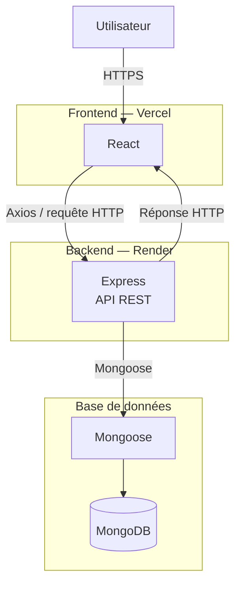

# Water-polo-team-manager

Ce projet implémente les fonctionnalités principales d'une application de gestion de l'organisation d'un club customisée à mon club local de water-polo.

## Stack technique

- **Frontend :** React · Vite
- **Backend :** Node.js · Express
- **Base de données :** MongoDB · Mongoose
- **Authentification :** JWT · cookies httpOnly
- **API :** REST
- **Type d'application :** PWA

## Gestion du projet

* Application de gestion d'équipe de water-polo :

  * Créer et rejoindre un groupe (`coach` / `player`)
  * Le coach valide les demandes des joueurs souhaitant rejoindre son groupe
  * Créer des événements (entraînements, matchs) au sein d'un groupe
  * Les joueurs répondent à un événement (présent / absent / incertain) avec un commentaire optionnel
  * Le coach visualise les réponses de tous les membres à un événement donné

* Objectif du projet : construire une application full-stack avec authentification, gestion de rôles, et suppression en cascade en base de données, jusqu'au déploiement réel.

* Ce que le projet m'a permis de travailler :

  * l'authentification par JWT en cookie httpOnly, et son adaptation en cross-domain une fois le frontend et le backend séparés en production (`secure`/`sameSite`).
  * la gestion de rôles et permissions côté backend (middlewares `requireRole`, vérifications d'appartenance à un groupe/événement).
  * les suppressions en cascade avec Mongoose (hooks `pre('findOneAndDelete')`).
  * le déploiement d'une architecture répartie sur plusieurs plateformes et les problèmes réseau qui en découlent (CORS, `trust proxy`, rate limiting).
  * la mise en place d'une PWA avec `vite-plugin-pwa` (manifest, service worker, icônes maskable).

* L'app est installable en tant que PWA. Le manifest et le service worker sont gérés avec VitePWA.

---

## Vidéo de présentation de l'application

* Parcours complet : création d'un compte, création d'un groupe, création d'un événement, demande d'un joueur à rejoindre un groupe, validation d'une demande d'adhésion par le coach, réponse d'un joueur à l'événement. 

Lien : [Vidéo de présentation](https://youtube.com/shorts/m_eRyhGbFgc?feature=share)

---

### Installation des dépendances et lancement en développement

```bash
npm install
npm run dev
```

* `npm run dev` : lance en parallèle le serveur Express (`server`) et Vite (`client`) via `concurrently`, avec `--host` côté client pour exposer sur le réseau local.

### Variables d'environnement nécessaires

**`server/.env`**
```
MONGO_URI=
JWT_SECRET=
NODE_ENV=development
CLIENT_URL=http://localhost:5173
```

**`client/.env`**
```
VITE_API_URL=http://localhost:3000
```

### Mode production du projet

```bash
npm run build --prefix client
npm run preview --prefix client
node server/bin/www
```

### Formatter les fichiers

```bash
npx prettier --write .
```

### Vérifier le code

```bash
npx eslint .
```

---

## Architecture



Le frontend React constitue l'interface utilisateur et communique avec l'API REST Express via Axios. Le backend gère l'authentification, l'autorisation et la logique métier. Mongoose fait l'interface avec MongoDB Atlas.

---

## Points forts

* Séparation des responsabilités backend : routes / controllers / middlewares / utils, avec des utilitaires réutilisables (`dbFinder`, `logicChecker`, `AppError`) pour limiter la duplication de logique de vérification.

* Le serveur ne fait pas confiance au client : chaque route sensible vérifie l'appartenance à un groupe/événement et le rôle de l'utilisateur avant d'agir.

* Suppressions en cascade cohérentes (groupe → événements → réponses ; utilisateur → groupes si coach, retrait des groupes si joueur).

* Système de demandes d'adhésion avec validation par le coach, plutôt qu'un accès direct par simple code.

* Authentification par JWT en cookie httpOnly, adaptée à un déploiement cross-domain (frontend et backend sur deux plateformes distinctes).

* Variables CSS globales (espacements, couleurs, typographies) et CSS Modules pour éviter les collisions de styles.

* PWA installable avec icônes correctement déclinées (`any` et `maskable`) et cache des requêtes API via Workbox.

* Déploiement sur trois plateformes distinctes (MongoDB Atlas, Render, Vercel) avec configuration CORS, rate limiting, et gestion des cookies adaptée à chaque environnement.

* Gestion du projet avec Git, commits réguliers.

## Points à améliorer

* Documentation du code partielle
* Certains hooks de fetch (`useGroups`, `useEvents`) gagneraient à être mutualisés dans un contexte partagé plutôt que refetchés indépendamment par chaque composant
* L'interface n'exploite pas tout ce que permet l'API REST (modifier un événement, modifier ses informations personnelles...)
* Nettoyage à faire sur certains composants plus anciens, écrits avant que je fixe des conventions plus cohérentes

## Points faibles

* Absence de tests automatisés (unitaires ou d'intégration)
* Certaines validations de champs côté backend pourraient être plus strictes (formats, longueurs)
* Le rate limiting a nécessité plusieurs ajustements entre dev et prod, signe que la configuration initiale n'avait pas anticipé cette distinction

---

## Sécurité

* **Tests manuels par requêtes HTTP** : chaque route des 4 modèles (`User`, `Group`, `Event`, `Response`) a été testée à la main (fichier `.http`) avec plusieurs profils (coach, joueur, utilisateur non authentifié, utilisateur hors du groupe concerné) pour vérifier les codes de retour (401/403/404) et l'absence d'accès à des données hors des permissions attendues.

* **Scan avec OWASP ZAP** sur le frontend et le backend déployés. Les alertes remontées (CSP incomplète, CORS `*` sur les assets statiques Vercel, absence de `preload` sur HSTS) ont été passées en revue une à une ; certaines relevaient de comportements par défaut de l'hébergeur plutôt que d'une vraie faille (ex : le CORS `*` sur des fichiers statiques déjà publics). Les points pertinents ont été corrigés (CSP complétée, ajout de `X-Frame-Options`, `X-Content-Type-Options`, `Referrer-Policy`, `Permissions-Policy` via `vercel.json`).

* Vérification complémentaire des en-têtes avec Mozilla Observatory et Security Headers.

* **Correction d'un bug de session** trouvé pendant ces tests : la déconnexion ne supprimait pas réellement le cookie JWT côté navigateur, `clearCookie` étant appelé sans les mêmes options (`httpOnly`, `secure`, `sameSite`) que celles utilisées à la création du cookie. Une session pouvait redevenir active après navigation vers une route invalide puis retour à l'accueil.

* Rate limiting séparé entre les routes d'authentification (plus strict) et le reste de l'API.

---

### IA - projet

* Assistance sur le débogage des interactions entre composants React (props, remontée d'état, cycle de vie avec StrictMode)
* Assistance sur la configuration CORS, cookies cross-domain et `trust proxy` en environnement de déploiement
* Assistance sur la mise en forme du CSS
* Aide à la mise en place de la PWA (manifest, icônes maskable, service worker)
* Assistance au diagnostic d'erreurs de déploiement (Render, variables d'environnement, MongoDB Atlas)
* Relecture et correction de bugs ponctuels dans les controllers et composants
* Explication des en-têtes de sécurité HTTP (CSP, HSTS, CORS) et aide à l'interprétation des alertes remontées par OWASP ZAP
